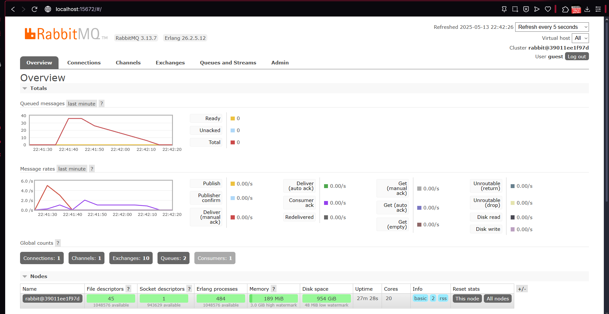
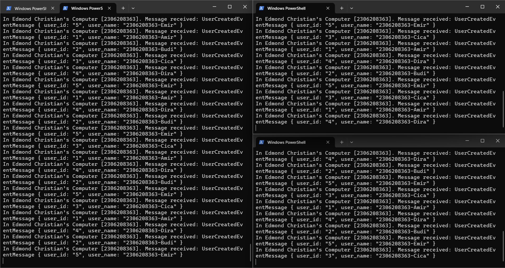
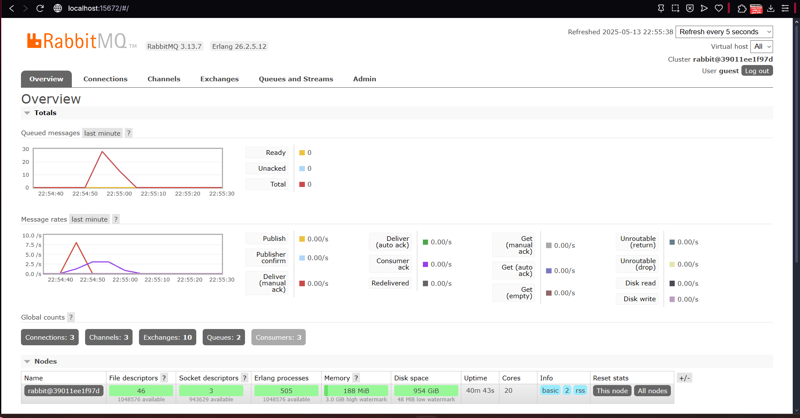
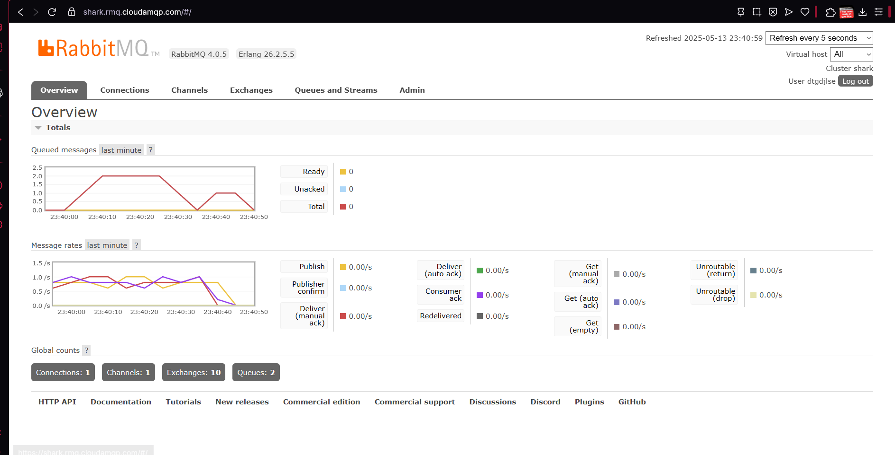
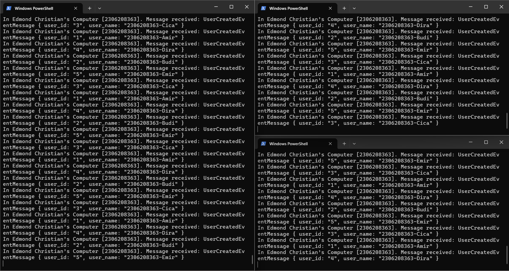
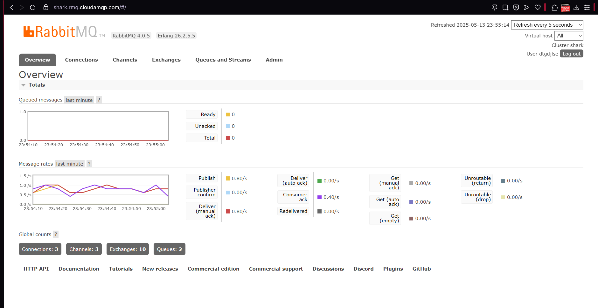

# Advanced Programming Module 9 Subscriber
**Nama: Edmond Christian** 
**NPM: 2306208363**

### Reflection 1
a. What is amqp?
- AMQP (Advanced Message Queuing Protocol) adalah standar protokol komunikasi untuk *message-oriented middleware* yang dibuat untuk memungkinkan pertukaran pesan antar aplikasi yang berbeda dalam sistem terdistribusi. AMQP mendefinisikan aturan komunikasi antara *messaging provider* dan *client*, sehingga berbagai implementasi dari protokol ini tetap dapat saling berkomunikasi secara konsisten dan aman walaupun dibuat dengan bahasa pemrograman/platform yang berbeda. AMQP menggunakan model komunikasi berbasis *exchange* dan *queue* yang fleskibel. Sebuah aplikasi akan mengirim/*publish* pesan ke *exchange*, lalu broker AMQP akan meneruskan pesan tersebut ke satu atau lebih *queue* berdasarkan *routing key* dan *binding* yang telah diatur. Selanjutnya, *consumer* akan mengambil pesan dari *queue*, memprosesnya, dan mengirimkan kembali "acknowledgment" ke broker. Contoh broker yang menggunakan AMQP adalah RabbitMQ, Apache Qpid, dan Apache ActiveMQ

b. What does it mean? `guest:guest@localhost:5672` , what is the first **guest**, and what is the second **guest**, and what is **localhost:5672** is for?
- `guest:guest@localhost:5672` adalah URL koneksi untuk menyambung ke AMQP broker seperti RabbitMQ yang dijalankan di lokal. **guest** pertama adalah username yang ingin digunakan untuk *login*. **guest** kedua adalah password yang ingin digunakan. Dan **localhost:5672** menunjukkan bahwa koneksi ditujukan ke komputer local (`localhost`) di port 5672, yang juga merpakan **default port** untuk protokol AMQP.

### Slow Subscriber Simulation

Pada simulasi *slow subscriber* saat *publisher* mengirim pesan, maka juga akan terjadi lonjakan pada grafik pertama yang menandakan *queued messages*. Hal ini terjadi karena sekarang *subscriber* disimulasikan untuk lambat dalam memproses pesan atau event yang dikirim *publisher* sehingga  kecepatan *subscriber* meng-*consume* pesan lebih kecil dari kecepatan *publiher* meng-*publish* pesannya. Akibatnya saat saya jalankan publisher 8 kali, grafik mencatat *queued messages* terbanyak sebanyak 36 pesan.

### Three Slow Subscribers Simulation

Pada grafik jika terdapat 3 *subscriber* terlihat bahwa *queued messaged* turun lebih cepat, ini terjadi karena setiap *slow subscriber* yang ada mengambil masing-masing 1 pesan unik (tidak *overlap*) dari *queue* sehingga pesan tersebut hilang dari queue. Dibandingkan dengan 1 *slow subscriber*, dengan adanya 3 *slow subscriber* penurunan pesan yang berada dalam *queue* menjadi lebih cepat sehingga terlihat bahwa pada grafik *queued messages*, jumlah terbanyak yang tercatat/terekam hanya 30 kurang walaupun *publisher* tetap dijalankan 8 kali (40 pesan). 
Menurut saya, dalam keadaan yang sebenarnya delay tidak hanya terjadi pada *subscriber* tetapi dapat juga terjadi saat *publisher* ingin mengirimkan pesan/*event*. Jadi untuk memerbaiki kode agar mengsimulasikan keadaan yang lebih realistis dapat ditambahkan kode delay pada *publisher* juga.

## Bonus
### Slow Subscriber Simulation (Cloud)

Pada grafik RabbitMQ yang dijalankan di *cloud* terdapat perbedaan yang cukup jelas. Pada grafik *queued messages*, grafiknya yang awalnya seperti lonjakan yang tajam yang naik secara cepat dan turun perlahan, di *cloud* grafiknya naik secara perlahan dan sempat datar lalu baru menurun secara perlahan. Hal ini berkaitan dengan grafik kedua, pada *localhost* garis merah atau pesan yang dikirim sempat naik sekilas dan turun dengan cepat juga, tetapi di *cloud* dikarenakan adanya *latency* antara server *cloud* (yang berlokasi di US) maka pengiriman pesan oleh *publisher* menjadi terhambat karena menunggu jaringan terhubung dengan server *cloud*, akibatnya pengiriman pesan tersebar dalam interval yang lebih lama dengan intensitas/nilai kecepatan yang lebih rendah. Karena hal itu, *subscriber* dapat hampir "mengikuti" pengiriman pesan yang banyak oleh *publisher* sehingga *queued messages* yang terekam lebih sedikit. *Subscriber* tidak dipengaruhi oleh *latency* server *cloud* RabbitMQ *subscriber* hanya perlu membuat koneksi sekali, sementara *publisher* membuat koneksi setiap kali dijalankan (setiap 5 pesan/*event* dikirim). Jumlah pesan yang saya kirim tetap 40 pesan atau setara 8 kali menjalankan *publisher*, tetapi maksimum *queued messages* yang terekam sebanyak 2. 

### Three Slow Subscribers Simulation

Pada grafik RabbitMQ yang dijalankan di *cloud*, jika ada 3 *subscribers* yang dijalankan terlihat bahwa tidak ada *queued messages* yang terekam dikarenakan *rate* pesan yang dikirimkan lebih kecil dari *rate* maksimum pesan diterima oleh ketiga *subscriber* (yang seharusnya sebanyak 3 pesan/*event* per detik). Jumlah *publisher* dijalankan tidak akan mempengaruhi *rate* pesan yang dikirim. Melainkan untuk meningkatkannya, dapat digunakan *publisher* yang dijalankan dalam lebih dari 1 terminal untuk meningkatkan *rate* pesan yang dikirim. Dengan ini, akan terjadi penumpukan *queued messages* seperti pada RabbitMQ *localhost*.